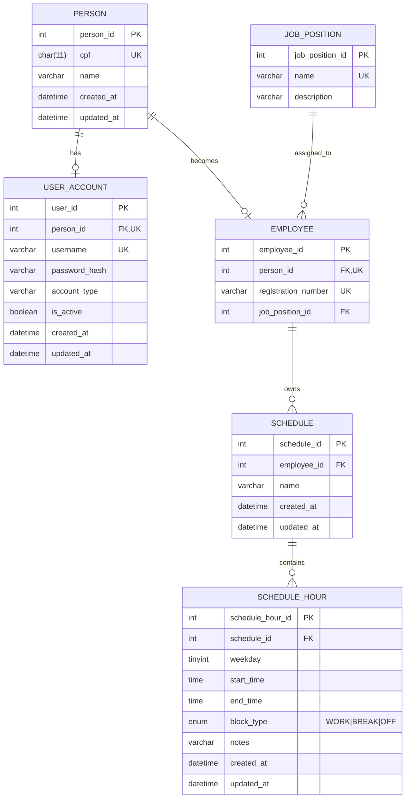

# Banco de dados (MySQL/MariaDB)

## Modelo (resumo)

## Entidade: PERSON (PESSOA)

**Finalidade:** guardar os dados basicos das pessoas do sistema.

**Campos principais**

- `person_id` (PK)
- `cpf` (UNIQUE)
- `name`
- `created_at`
- `updated_at`

**Relacionamento**

- Uma pessoa pode virar um funcionario:
    
    `PERSON (1) -> (0..1) EMPLOYEE`
    
- Uma pessoa pode ter credenciais de login:
    
    `PERSON (1) -> (0..1) USER_ACCOUNT`
    
Comentario importante:

> O tipo de conta (ADMIN/EMPLOYEE/BOTH) e controlado por user_account.account_type.
> 

---

## Entidade: USER_ACCOUNT (USUÁRIO)

**Finalidade:** armazenar credenciais para autenticação e permitir **Login/Logoff** e **CRUD Usuário**.

**Campos principais**

- `user_id` (PK)
- `person_id` (FK, UNIQUE)
- `username` (UNIQUE)
- `password_hash`
- `account_type` (ADMIN/EMPLOYEE/BOTH)
- `is_active` (padrão 1/ativo)
- `created_at`
- `updated_at`

**Relacionamento**

- Um usuário pertence a uma pessoa:
    
    `PERSON (1) → (0..1) USER_ACCOUNT`
    

Comentário importante:

> password_hash existe por segurança: senha nunca é salva em texto puro.
> 
> 
> `is_active` permite “bloquear” acesso sem apagar o registro (útil pra logoff forçado / desativação).
> `account_type` define o tipo de conta (ADMIN/EMPLOYEE/BOTH).
> 

---

## Entidade: JOB_POSITION (CARGO)

**Finalidade:** armazenar os cargos disponíveis para funcionários.

**Campos principais**

- `job_position_id` (PK)
- `name` (UNIQUE)
- `description` (opcional)

**Relacionamento**

- Um cargo pode estar ligado a vários funcionários:
    
    `JOB_POSITION (1) → (N) EMPLOYEE`
    

Comentário importante:

> Cada funcionário sempre precisa ter cargo, então job_position_id é obrigatório na tabela EMPLOYEE.
> 

---

## Entidade: EMPLOYEE (FUNCIONÁRIO)

**Finalidade:** identificar uma pessoa como funcionário e guardar dados exclusivos (matrícula e cargo).

**Campos principais**

- `employee_id` (PK)
- `person_id` (FK, UNIQUE)
- `registration_number` (UNIQUE)
- `job_position_id` (FK)

**Relacionamento**

- Um funcionário pertence a uma pessoa:
    
    `PERSON (1) → (0..1) EMPLOYEE`
    
- Um funcionário tem um cargo obrigatório:
    
    `EMPLOYEE (N) → (1) JOB_POSITION`
    
- Um funcionário pode ter várias escalas ao longo do tempo:
    
    `EMPLOYEE (1) → (N) SCHEDULE`
    

Comentário importante:

> person_id é UNIQUE porque uma pessoa não pode virar funcionário duas vezes.
> 
> 
> `job_position_id` não pode ser nulo, porque funcionário sem cargo vira caos administrativo.
> 
> 
> 

---

## Entidade: SCHEDULE (ESCALA)

**Finalidade:** representar um “pacote” de horários de um funcionário (ex: “Escala Janeiro”, “Semana 3”).

**Campos principais**

- `schedule_id` (PK)
- `employee_id` (FK)
- `name` (opcional)
- `created_at`
- `updated_at`

**Relacionamento**

- Uma escala pertence a um funcionário:
    
    `EMPLOYEE (1) → (N) SCHEDULE`
    
- Uma escala contém vários registros de horários:
    
    `SCHEDULE (1) → (N) SCHEDULE_HOUR`
    

Comentário importante:

> Aqui a escala é livre: você pode cadastrar quantos dias quiser e com quantos blocos quiser, sem ficar preso à semana fixa.
> 

---

## Entidade: SCHEDULE_HOUR (ESCALA_HORARIO)

**Finalidade:** registrar blocos de horário **totalmente flexíveis** por **dia da semana** (quantos blocos forem necessários no mesmo dia).

**Campos principais**

- `schedule_hour_id` (PK)
- `schedule_id` (FK)
- `weekday` (TINYINT, 0=dom ... 6=sáb)
- `start_time`
- `end_time`
- `block_type` (WORK, BREAK, OFF)
- `notes` (opcional)
- `created_at`
- `updated_at`

**Relacionamento**

- Um horário pertence a uma escala:
    
    `SCHEDULE (1) → (N) SCHEDULE_HOUR`
    

Comentário importante:

> Essa tabela é o “modo freestyle”: você pode lançar:
> 
> - vários blocos no mesmo dia (manhã, tarde, noite)
> - intervalos como blocos do tipo BREAK
> - folga como OFF (ou simplesmente não lançar nada naquele dia)
> 
> 
> **Folga** = ausência de registros no dia da semana.
> 

# Documentação dos Triggers

## Objetivo geral

**Finalidade:** garantir que o banco atualize automaticamente os campos `updated_at` e propague essa atualização para as entidades “pai”, sem depender da API mandar `updated_at` manualmente.

Isso é essencial para:

- **Sincronização do APP** via `updated_at`
- evitar inconsistência quando diferentes rotas do backend alteram dados
- permitir “sync por entidade pai” (ex: mudou horário → escala muda → funcionário muda → pessoa muda)

---

## Regra principal (filho → pai → avô)

Quando uma tabela “filha” muda, o banco **toca** o `updated_at` das tabelas acima:

- Mudou `schedule_hour` → atualiza `schedule.updated_at` → `employee.updated_at` → `person.updated_at`
- Mudou `schedule` → atualiza `employee.updated_at` → `person.updated_at`
- Mudou `user_account` → atualiza `person.updated_at`
- Mudou `employee` → atualiza `person.updated_at`

---

# Triggers por entidade

## USER_ACCOUNT → PERSON

### Triggers

- `trg_user_account_ai_touch_person` (AFTER INSERT)
- `trg_user_account_au_touch_person` (AFTER UPDATE)
- `trg_user_account_ad_touch_person` (AFTER DELETE)

**O que fazem:** sempre que credenciais mudarem (criar usuário, alterar username/senha, desativar, deletar), marca `person.updated_at = NOW()`.

**Motivo prático:**

> Se o app sincroniza pessoas, ele precisa saber que “algo daquela pessoa” mudou, mesmo que tenha sido só o login.
> 

---

## EMPLOYEE → PERSON

### Triggers

- `trg_employee_ai_touch_person` (AFTER INSERT)
- `trg_employee_au_touch_person` (AFTER UPDATE)
- `trg_employee_ad_touch_person` (AFTER DELETE)

**O que fazem:** se o funcionário for criado/alterado/removido, atualiza `person.updated_at`.

**Motivo prático:**

> Matrícula/cargo afetam a pessoa no contexto do sistema. O app não pode ficar com dados antigos.
> 

---

## SCHEDULE → EMPLOYEE + PERSON

### Triggers

- `trg_schedule_ai_touch_employee_person` (AFTER INSERT)
- `trg_schedule_au_touch_employee_person` (AFTER UPDATE)
- `trg_schedule_ad_touch_employee_person` (AFTER DELETE)

**O que fazem:** mexeu em escala (criou/editou/removeu), atualiza:

- `employee.updated_at`
- `person.updated_at`

**Motivo prático:**

> Escala é uma “configuração” do funcionário. Se muda escala, muda o pacote de dados que o app deve baixar.
> 

---

## SCHEDULE_HOUR → SCHEDULE + EMPLOYEE + PERSON

### Triggers

- `trg_schedule_hour_ai_touch_parents` (AFTER INSERT)
- `trg_schedule_hour_au_touch_parents` (AFTER UPDATE)
- `trg_schedule_hour_ad_touch_parents` (AFTER DELETE)

**O que fazem:** mexeu em horário (bloco de dia), atualiza:

- `schedule.updated_at`
- `employee.updated_at`
- `person.updated_at`

**Motivo prático:**

> É o trigger mais importante: mudou um bloco de horário e o app precisa perceber sem depender da API tocar nos pais manualmente.
> 

---

# Observações de sync (offline-first)

- O app usa `client_id` para criar registros offline.
- O servidor devolve `server_id`.
- A sincronização usa `updated_at` incremental.
- **Escala semanal** usa `weekday` (0=domingo..6=sábado).
- **Folga** é ausência de registro no dia.
- Para permitir múltiplos horários no mesmo dia:
  - Remover UNIQUE de `(schedule_id, weekday)`.
  - Criar índice normal `idx_schedule_weekday`.

Script: `api/sql/004_allow_multiple_schedule_hours.sql`

